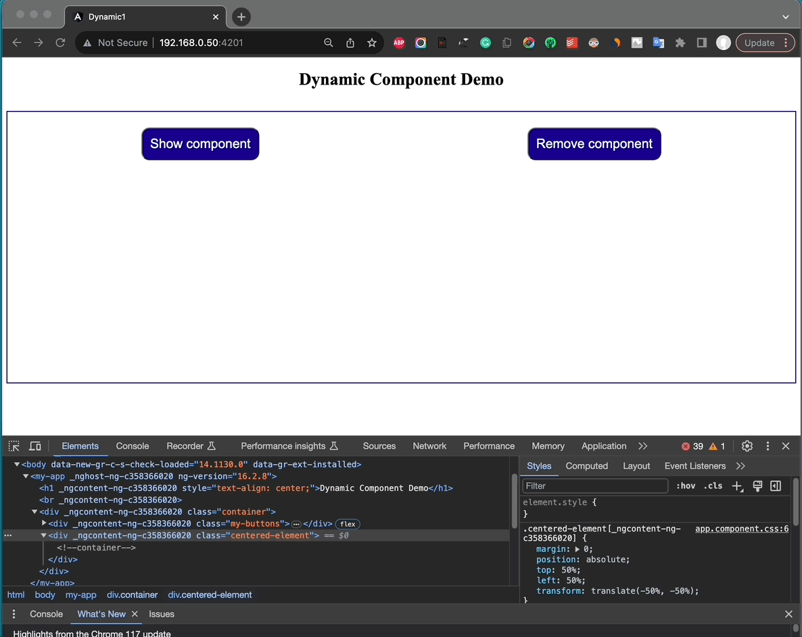
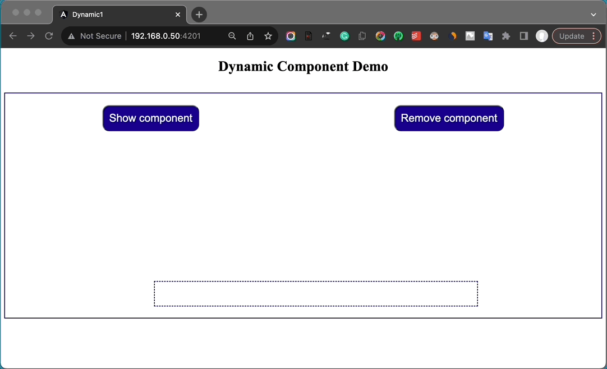
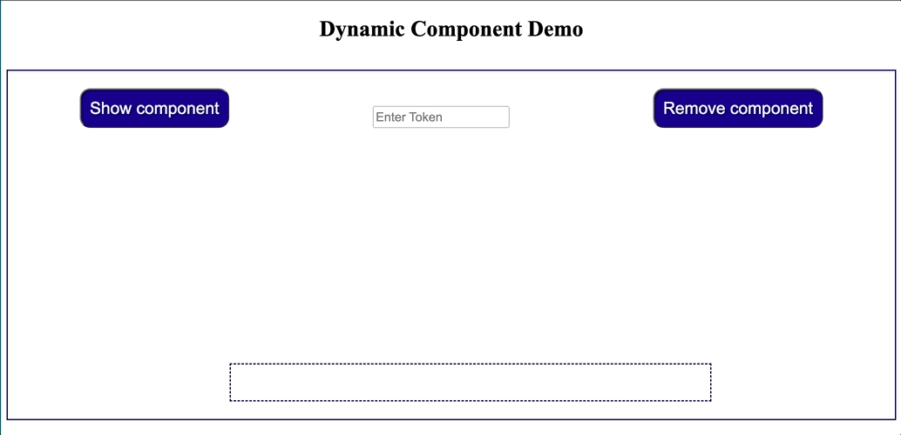
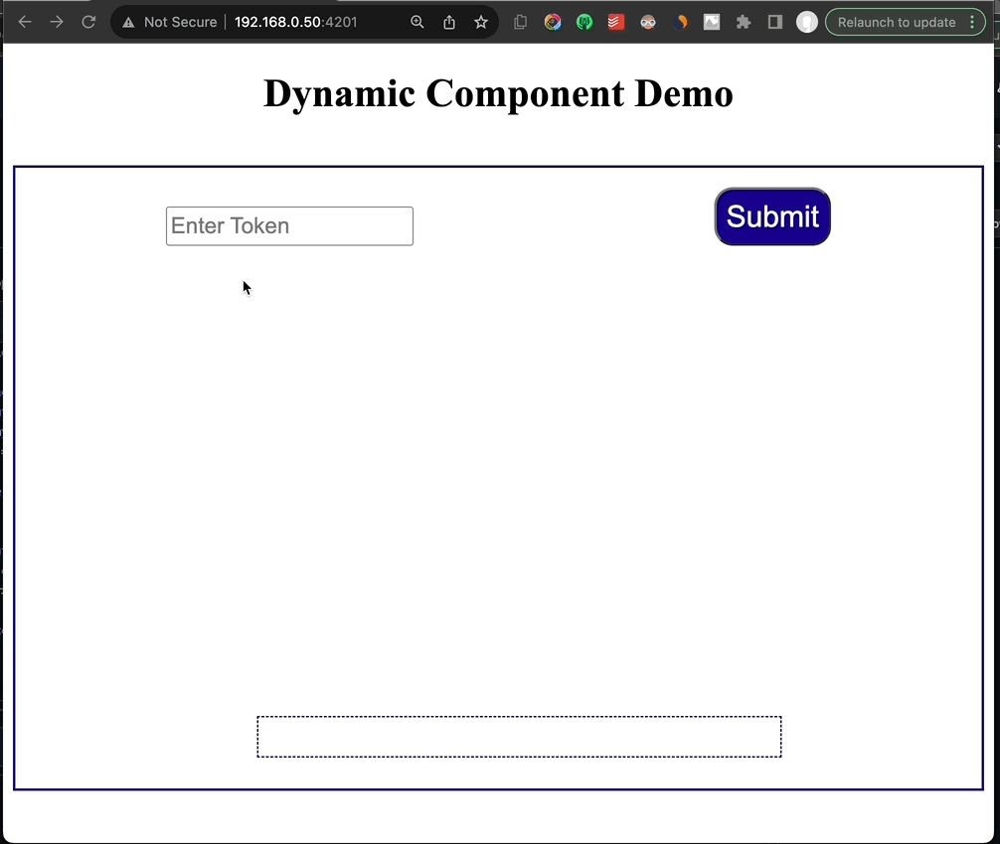

# Dynamic1

# This is a simple demo project, about dynamic loading of Angular components

For the demo purposes, just 2 components are used. 
The 1st one is the known 'AppComponent' created by default from Angular CLI during new project generation. This component will be the 'host' or 'parent' component of the 2nd one which will be the component that will be dynamically loaded. The 2nd one is the 'MyDynamicComponent', and it is the 'dynamic' component.

- In the 1st commit a template variable is used as an entry-point (or anchor-point). 
- In the 2nd commit a helper directive is used to apply the dynamic component.



- In the 3rd commit the @Output decorator has been used to pass data up from the dynamic component to host/parent component.



- In the 4th and 5th commit dynamic component(s) became almost totally unknown to the hosting component. A factory component service is used to return the appropriate/selected component to the helper directive on the basis of a string token provided. The only piece of information that is still needed in the hosting component is the emitted event of mouse hovering over the component, that is used from the hosting component.



- In the 6th commit dynamic component(s), as well as the helper directive became totally unknown to the host component. In other words the host component is absolutely decoupled and independent feom them. This is achieved by using the @Input @Output decorators within our helper directive and then applying it to the host component template, using property binding and event binding syntax respectively.
```
    <ng-container
      adDynamic
      [inVal]="input.value"
      (inAreaMsg)="dynCompMsg($event)" >
    </ng-container>
```


## Default Instructions
This project was generated with [Angular CLI](https://github.com/angular/angular-cli) version 16.2.0.

## Development server

Run `ng serve` for a dev server. Navigate to `http://localhost:4200/`. The application will automatically reload if you change any of the source files.

## Code scaffolding

Run `ng generate component component-name` to generate a new component. You can also use `ng generate directive|pipe|service|class|guard|interface|enum|module`.

## Build

Run `ng build` to build the project. The build artifacts will be stored in the `dist/` directory.

## Running unit tests

Run `ng test` to execute the unit tests via [Karma](https://karma-runner.github.io).

## Running end-to-end tests

Run `ng e2e` to execute the end-to-end tests via a platform of your choice. To use this command, you need to first add a package that implements end-to-end testing capabilities.

## Further help

To get more help on the Angular CLI use `ng help` or go check out the [Angular CLI Overview and Command Reference](https://angular.io/cli) page.
